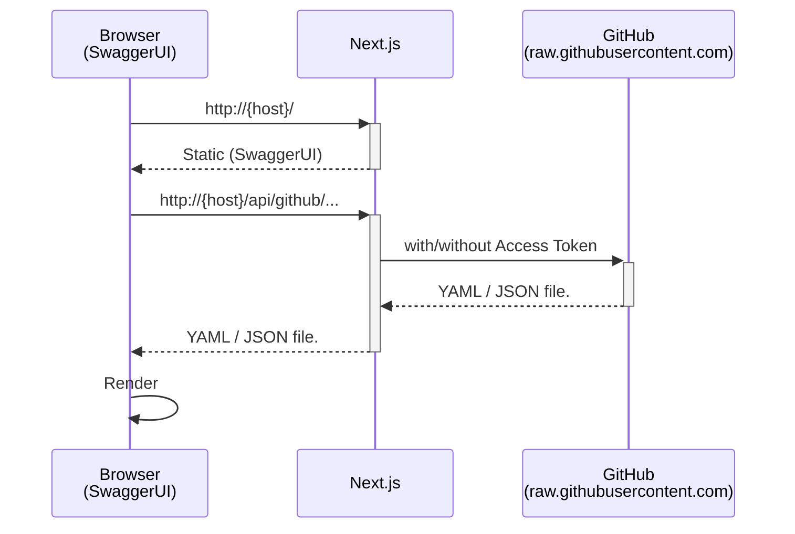
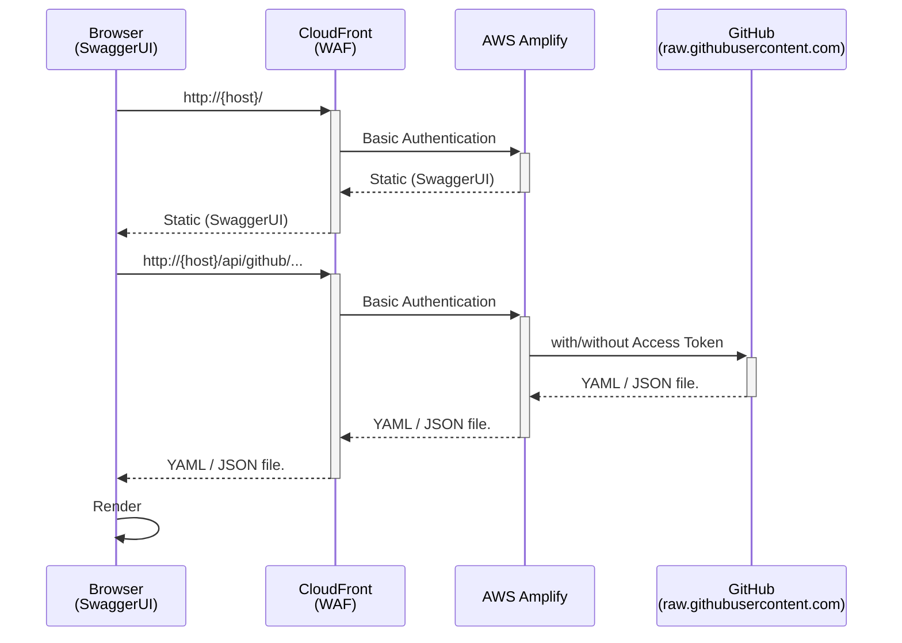

[GitHub]:https://github.com/
[SwaggerUI]:https://swagger.io/tools/swagger-ui/
[volta]:https://volta.sh/
[Personal Access Token]:https://docs.github.com/en/authentication/keeping-your-account-and-data-secure/managing-your-personal-access-tokens

# swagger-github

This is a project for displaying OpenAPI 3.0 specification files hosted on [GitHub] using [SwaggerUI] in HTML format.

It allows you to specify any specification file via URL:

* Any GitHub repository
* Any git branch
* Any `*.json` / `*.yaml` file located at any path

## Demo on Vercel

https://swagger-github.vercel.app/OAI/OpenAPI-Specification/main/examples/v3.0/petstore.yaml

## How to use

URL Format:

```
http(s)://your.domain/{owner}/{repo}/{branch}/{path_to_spec}
```

For example, if you want to display the following OpenAPI 3.0 specification using SwaggerUI.

https://raw.githubusercontent.com/OAI/OpenAPI-Specification/main/examples/v3.0/petstore.yaml

In that case, you can view the SwaggerUI by accessing the following URL:

https://swagger-github.vercel.app/OAI/OpenAPI-Specification/main/examples/v3.0/petstore.yaml

## Environment Variables

| Name | Description | Default |
|:------|:-------------|:---------|
| BEARER_TOKEN | Authorization Bearer Token for accessing `PROXY_DOMAIN`.<br/>e.g. GitHub [Personal Access Token] |  |
| PROXY_DOMAIN | Specify the domain where the YAML/JSON files are stored. The server will perform HTTP proxy access to this domain. | `raw.githubusercontent.com` |
| RESOLVE_ALL_REFS | Resolve all `$ref` references on Server-Side. | `false` |
| RESOLVE_ALL_REFS_DEPTH_LIMIT | This is the limit value for the depth of nesting in a YAML / JSON structure for `RESOLVE_ALL_REFS=true` | `30` |

## Sequence Diagram



## Getting Started (Dev)

First, install Node.js `v20.10.0`, or [volta].

```bash
node -v
# v20.10.0
```

Install Node.js modules.

```bash
npm install
```

Run the development server:

```bash
npm run dev
```

Open [http://localhost:3000](http://localhost:3000) with your browser to see the result.

## Deploy

This application does not have security measures in place. **It is strongly recommended not to make it available on the internet**, and to use private networks or IP address restrictions instead.

### Deploy on Server

Build and start the server.

```bash
npm run build
npm run start
```

Open [http://{server-ip-address}:3000](http://localhost:3000) with your browser to see the result.

### Deploy on Vercel

The easiest way to deploy your Next.js app is to use the [Vercel Platform](https://vercel.com/new?utm_medium=default-template&filter=next.js&utm_source=create-next-app&utm_campaign=create-next-app-readme) from the creators of Next.js.

Check out our [Next.js deployment documentation](https://nextjs.org/docs/deployment) for more details.

### Deploy on AWS Amplify

How to deploy Next.js with AWS Amplify.

* [English](https://docs.aws.amazon.com/amplify/latest/userguide/deploy-nextjs-app.html)
* [日本語](https://docs.aws.amazon.com/ja_jp/amplify/latest/userguide/deploy-nextjs-app.html)

Then, enforce IP address restrictions by using CloudFront & WAF.

* [English](https://docs.aws.amazon.com/prescriptive-guidance/latest/patterns/enable-aws-waf-for-web-applications-hosted-by-aws-amplify.html)
* [日本語](https://docs.aws.amazon.com/ja_jp/prescriptive-guidance/latest/patterns/enable-aws-waf-for-web-applications-hosted-by-aws-amplify.html)


